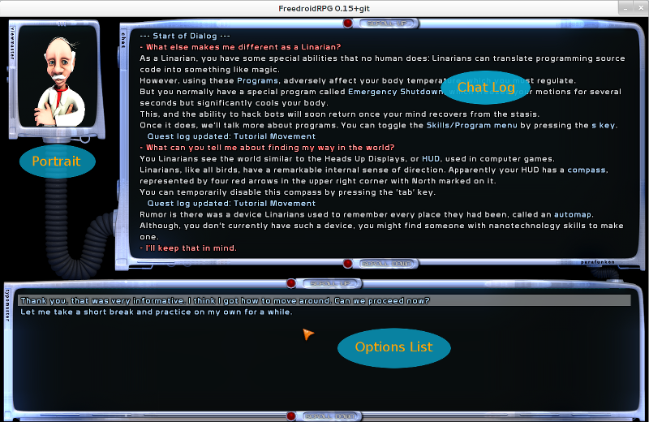

Dialog Designer Manual {#dialog}
================================

**Note:** This manual describes how to technically write a dialog file.\n
It does not (_yet_) contain any information on how to structure the nodes of a
dialog, or how to write a _good story_.

To interact with the FreedroidRPG core, some Lua functions are provided, defined
in src/lua.c and map/script_helpers.lua. The documentation of those functions is to
be written.

To interact with FreedroidRPG game objects Lua bindings are provided. For instance,
_FDtux_ is the Lua binding of _Tux_, the internal data defining the player and her
ingame's character.\n
The Lua bindings are documented in the [Modules](../modules.html) section of the Doxygen doc.
\n
\n
Structure of a basic dialog file {#basic_dialog}
================================================
-------------------------------------------------------------------------------

A dialog file is written in Lua, and, in its basic form, it **must** have the
following structure:

~~~~~~~~~~~{.lua}

local Tux = FDrpg.get_tux()

return {
    FirstTime = function()
                    -- lua code to execute the first time the dialog is open
                end,

    EveryTime = function()
                    -- lua code to execute each time the dialog is open
                end,

    {
        -- node definition
    },

    {
        -- node definition
    },
}
~~~~~~~~~~~

_Note:_ `FirstTime` and `EveryTime` are optionals.

A `dialog` is thus a Lua program returning an array, containing 2 optional named fields,
and a series of unnamed fields containing node definitions.

\n
\n
Structure of a basic node {#basic_node}
=======================================
-------------------------------------------------------------------------------

In its basic form, a node is a Lua array containing some specific named fields:

~~~~~~~~~~~{.lua}
{
    id = "node id",
    text = "some text",
    echo_text = true,
    topic = "topic id",
    code = function()
               -- lua code to execute when the node is selected
           end,
},
~~~~~~~~~~~

with:
- `id` : A string uniquely identifying the node in the dialog [mandatory].
- `text` : The text to display in the `Options List` on the chat screen (see image
           below), if the node is `enabled` [optional, default: "NOTEXT"].
- `echo_text` : If false, do not echo the option's text in the `Chat Log` [optional, default: true].
- `topic` : A string defining to which `topic group` the node is attached [optional].
- `code` : The action to execute when the node is selected by the user. It can call,
           for instance, functions to output text in the `Chat Log` (see image below) [mandatory]

\n
Node enabling
-------------

By default, a node is disabled on the first run of a dialog. Two methods are available
to enable a node when a dialog is first loaded:

1. Set the optional 'enabled` field of a node definition:
   ~~~~~~~~~~~{.lua}
   {
       id = "node0",
       enabled = true,
       text = "Hello.",
       code = function()
                  -- lua code to execute when node0 is selected
              end,
   },
   ~~~~~~~~~~~
2. Use the `show()` function in the `FirstTime` code:
   ~~~~~~~~~~~{.lua}
   FirstTime = function()
       ...
       show("node0", "node1", ...)
       ...
   end,
   ~~~~~~~~~~~

The current value of the `enabled` field of each dialog's node is saved when the
dialog is closed, and restored on next call to the dialog. A dialog's state is
thus consistent between calls.

_Note_: The current `topic` stack is not saved when a dialog is closed, by design
choice.

\n
FirstTime and EveryTime
-----------------------

Internally, FirstTime and EveryTime are actual nodes, in order to keep
consistency of the dialog's nodes.

For instance,

~~~~~~~~~~~{.lua}
FirstTime = function()
                show("node0", "node1")
            end,
~~~~~~~~~~~

is internally transformed into:

~~~~~~~~~~~{.lua}
FirstTime = {
                id = "FirstTime",
                code = function()
                           show("node0", "node1")
                end,
            }
~~~~~~~~~~~

\n
Reference to an ingame datastructure
------------------------------------

As was stated in the introduction, there are two sets of functions that can be
used to interact with the game:

- The first set is composed of functions defined as global Lua data, such as the
   _show()_ function used in the former paragraph. Being global data, those functions
   can be used _directly_.

- The second set is composed of functions defined in Lua bindings (_Lua classes_).
   For instance, all functions related to an NPC are defined in the `FDnpc` binding
   (not yet available...). To use them, a reference of an actual NPC is to be created (using
   the `FDrpg` Lua module), so that those functions will be _applied_ to that specific NPC.
   Such a reference is usually called an _instance_.\n
   In the following exemple, we want to get the amount of gold of the user. A `get_gold()`
   function is available in the `FDtux` class. So, we first set the local var `Tux` as
   an instance of `FDtux`, and then call `get_gold()` on that instance:
   ~~~~~~~~~~~{.lua}
   code = function()
	local Tux = FDrpg.get_tux()
	local amount_of_gold = Tux:get_gold()
	...
   end,
   ~~~~~~~~~~~

More than often, the `Tux` instance is needed in every node's script. To avoid
the need to create that instance in each script, we prefer to make it be available
to the whole dialog, using a local upvalue as was shown in the very first listing:

~~~~~~~~~~~{.lua}

local Tux = FDrpg.get_tux()

return {
    FirstTime = function()
                    -- lua code to execute the first time the dialog is open
                end,

    EveryTime = function()
                    -- lua code to execute each time the dialog is open
                end,

    {
        -- node definition
    },

    {
        -- node definition
    },
}
~~~~~~~~~~~

This also enables the use of `Tux` even outside of node's scripts, for instance
in `text` definitions (see @ref advanced_text).

\n
\n
Advanced usage of nodes {#advanced_nodes}
=========================================
-------------------------------------------------------------------------------

Computed `text` fields {#advanced_text}
---------------------------------------

Besides the use of a _static_ string to set the value of a `text` field, it is
also possible to use a computed value. Two forms are available:

- 
  ~~~~~~~~~~~{.lua}
  text = "Hello. I have " .. Tux:get_gold() .. " credits in my pocket.",
  ~~~~~~~~~~~
  In this form, the `text` value is computed each time the dialog is loaded, and
  the `text` content will not change while the chat screen is open.
- 
  ~~~~~~~~~~~{.lua}
  text = function()
             return "Hello. I have " .. Tux:get_gold() .. " credits in my pocket."
         end,
  ~~~~~~~~~~~
  In this form, the `text` value is a function, which will be called each time
  the text is to be displayed. Thus, its content can change during a chat.

_Note about internationalization_: `gettext` markers have to be added if a string
needs to be translated. For instance, using the first form:
~~~~~~~~~~~{.lua}
text = _"Hello. I have " .. Tux:get_gold() .. _" credits in my pocket.",
~~~~~~~~~~~
But then 2 separate unrelated strings are defined in the l10n template file (.po),
confusing the translators. You should rather use one single string, with text
formatting:
~~~~~~~~~~~{.lua}
text = string.format(_"Hello. I have %s credits in my pocket.", Tux:get_gold()),
~~~~~~~~~~~

\n
Accessing the dialog structure from a node's code {#advanced_code}
------------------------------------------------------------------

The Lua code of a node can access the current node and current dialog by
adding input parameters to the code's function:

~~~~~~~~~~~{.lua}
code = function(this_node, this_dialog)
           ...
       end,
~~~~~~~~~~~

There are currently no _real_ actual needs for this feature, but it can be used
to implement some _dynamicity_.

For instance, to change a node's text, one can write:

~~~~~~~~~~~{.lua}
text = "initial text",
code = function(this_node, this_dialog)
           if (such_condition) then
               this_node.text = "new_text"
           end
       end,
~~~~~~~~~~~

To change another node's content, for instance, the dialog's interface can be used
to get a reference to that other node:

~~~~~~~~~~~{.lua}
code = function(this_node, this_dialog)
           if (such_condition) then
               other_node = this_dialog:find_node("the_other_node")
               other_node.text = "new_text"
           end
       end,
~~~~~~~~~~~

\n

Computed nodes {#computed_node}
-------------------------------

A special node description can be used to insert computed nodes (i.e. nodes
programmatically defined) in a dialog:

~~~~~~~~~~~{.lua}
{
    topic = "one_topic",
    generator = generator_fun,
},
~~~~~~~~~~~

_generator_fun_ is a function call. It can also be a function definition, which
will be called only when the dialog is loaded.\n

The called function *must* return an array of nodes. Those _generated_ nodes are
inserted into the current dialog, at the same level than the other nodes. There
is thus no kind of _node hierarchy_ in a dialog.

Once the generated nodes are inserted, the `topic` value (if set, this is an 
optional field) is set on each of them.

**Note:** Due to the flat nature of the resulting dialog structure, care must be
taken so that the ids of the generated nodes do not collide with the ids of other
nodes. One way to ensure it is to use an id prefix:

~~~~~~~~~~~{.lua}
generator = function()
                return {
                    {
                        id = "foo.node0",
                        ...
                    },
                    {
                        id = "foo.node1",
                        ...
                    }
                }
            end,
~~~~~~~~~~~

This later example does not really make sense, as is. Obviously, the generated
nodes could have been directly written into the dialog.\n
However, it introduces the possibility to insert nodes defined in an external
file, through the use of an `include()` function: 

~~~~~~~~~~~{.lua}
-- File: external.lua
return {
    {
        id = "foo.node0",
        ...
    },
    {
        id = "foo.node1",
        ...
    }
}
~~~~~~~~~~~

~~~~~~~~~~~{.lua}
-- File: dialog.lua
return {
    FirstTime = ...,
    {
        id = "node0",
        ....
    },
    ....
    {
        generator = include("external")
    }
    ....
}
~~~~~~~~~~~

An actual use of computed nodes will be shown later in this manual, but here is
a simple example:

~~~~~~~~~~~{.lua}
generator = function()
                nodes = {}
                names = { "Dixon", "Ewald", "Koan", "Tamara" }
                --
                -- Create a node for each name, which starts a dialog with the
                -- associated NPC
                --
                for i,name in ipairs(names) do
                    nodes[#nodes + 1] = {
                        id = "node_" .. name,
                        text = "I want to talk with " .. name,
                        enabled = true,
                        code = function()
                            npc_says("Ok. I'm calling " .. name)
                            start_chat(name)
                        end
                    }
                end
                return nodes
            end
~~~~~~~~~~~

**Important Note:** Due to the way `include()` is implemented, local variables
of the main dialog are unavailable to the nodes inserted by a call to `include()`.

\n
\n
Advanced dialog file structure {#advanced_structure}
===================================================
-------------------------------------------------------------------------------

Being a Lua script, loaded and _executed_ by the dialog engine when a chat is
started, a dialog file can use standard Lua features, such as local upvalues.
Those can be used to improve dialog script readability.

For instance, the last example of the former paragraph could be written:

~~~~~~~~~~~{.lua}
local names = { "Dixon", "Ewald", "Koan", "Tamara" }

local chat_nodes_generator = function()
    nodes = {}
    for i,name in ipairs(names) do
         nodes[#nodes + 1] = {
            id = "node_" .. name,
            text = "I want to talk with " .. name,
            enabled = true,
            code = function()
                npc_says("Ok. I'm calling " .. name)
                start_chat(name)
            end
        }
    end
    return nodes
end

return {
    {
        generator = chat_nodes_generator()
    },
    {
        id = "end_node",
        text = "Bye bye",
        enabled = true,
        code = function() end_dialog() end
    }
}
~~~~~~~~~~~

or:

~~~~~~~~~~~{.lua}
local names = { "Dixon", "Ewald", "Koan", "Tamara" }

local chat_node_generator = function(name)
    return {
        id = "node_" .. name,
        text = "I want to talk with " .. name,
        enabled = true,
        code = function()
            npc_says("Ok. I'm calling " .. name)
            start_chat(name)
        end
    }
end

return {
    {
        generator = function()
            nodes = {}
            for i,name in ipairs(names) do
                nodes[#nodes + 1] = chat_node_generator(name)
            end
        end
    },
    {
        id = "end_node",
        text = "Bye bye",
        enabled = true,
        code = function() end_dialog() end
    }
}
~~~~~~~~~~~

Obviously, putting the `names` array outside of the function definitions only
makes sense if the array is used in other places.

**Note:** Do not forget the `local` keyword to avoid to screw up the Lua global
environment.

\n
\n
A whole dialog example {#dialog_example}
=========================================
-------------------------------------------------------------------------------

We will use the `Dude` dialog as an example of how to solve some specific needs
by the use of the dialog engine API. Not all dialogs involve this kind of lua
programming, so this is somehow an extreme example of the dialog engine features.

The `Dude` dialog contains a list of nodes used to start a chat with all the NPCs
of the game.

We will only detail some parts of the dialog, and use a lightly different
implementation of the code to ease the explanations. See the Dude.lua file for
the actual code.

\n
Creating the node list
----------------------

We have to automatically create a list of nodes to start all dialogs present in
the dialogs/ subdir of the game (defined in the FDdialog.dialogs_dir variable).

We use a FDutils.system function to scan that subdir and get a list of the files
that it contains (apart from some exceptions such as subdialog files):

~~~~~~~~~~~{.lua}
local exclude = {
    -- subdialogs can not be run solely
    "614_sub.lua", "c-net-nethack_sub.lua",
    -- dialog of terminals can not be run, currently, because they have no associated 'bot'
    "Cryo-Terminal.lua", "c-net.lua"
}

local dircontent = FDutils.system.scandir(FDdialog.dialogs_dir, ".*%.lua", exclude)
~~~~~~~~~~~

For each found file, we have to remove the .lua file extension to get the NPC name,
and we create a node to start a dialog with that NPC.

~~~~~~~~~~~{.lua}
local nodes = {}
for none,filename in ipairs(dircontent) do
    local dialogname = string.sub(filename, 1, -(string.len(".lua") + 1))
    nodes[#nodes + 1] = {
        id = dialogname,
        text = dialogname,
        enabled = true,
        code = function()
            Tux:says(_"Starting " .. dialogname)
            start_chat(dialogname)
        end,
    }
end
~~~~~~~~~~~

\n
So we end up with the following _generator_ node:

~~~~~~~~~~~{.lua}
-- File: Dude.lua
return {
    ...
    {
        generator = function()
                        local exclude = {
                            -- subdialogs can not be run solely
                            "614_sub.lua", "c-net-nethack_sub.lua",
                            -- dialog of terminals can not be run, currently, because they have no associated 'bot'
                            "Cryo-Terminal.lua", "c-net.lua"
                        }

                        local dircontent = FDutils.system.scandir(FDdialog.dialogs_dir, ".*%.lua", exclude)

                        local nodes = {}
                        for none,filename in ipairs(dircontent) do
                            local dialogname = string.sub(filename, 1, -(string.len(".lua") + 1))
                            nodes[#nodes + 1] = {
                                id = dialogname,
                                text = dialogname,
                                enabled = true,
                                code = function()
                                    Tux:says(_"Starting " .. dialogname)
                                    start_chat(dialogname)
                                end,
                            }
                        end
                    end
    },
    ...
}
~~~~~~~~~~~

\n
Displaying the list of available options
----------------------------------------

In the `EveryTime` node of the dialog, we want to display a list of all node's ids.

The nodes are stored in the `dialog.nodes` array, so we can loop on its content to
retrieve all nodes and display their ids:

~~~~~~~~~~~{.lua}
-- File: Dude.lua
return {
    ...
    EveryTime = function(this_node, this_dialog)
                    ...
                    local node_list = ""
                    -- loop on nodes and append each node id to the list
                    for idx,node in ipairs(this_dialog.nodes) do
                        node_list = node_list .. node.id .. ", "
                    end
                    -- remove the trailing ", "
                    node_list = string.sub(node_list, 1, -3)

                    npc_says(node_list)
                end,
    ...
}
~~~~~~~~~~~

\n
Execute a node chosen by the player
-----------------------------------

In the `EveryTime` node, once the list of available options is displayed, we
want to let the player input the name of one NPC, i.e. one of the node's id that
we inserted into the dialog, and execute the code of the selected node.

A call to `user_input_string()` is used to interact with the player and get
the name of a dialog:

~~~~~~~~~~~{.lua}
local actionname = user_input_string("Please enter the dialog name of the desired NPC")
~~~~~~~~~~~

We then search for that name in the dialog node's list:

~~~~~~~~~~~{.lua}
local actionnode = this_dialog:find_node(actionname)
~~~~~~~~~~~

And finally, if found, we execute the node's code:
~~~~~~~~~~~{.lua}
if (actionnode and actionnode.code) then
    actionnode:code(this_dialog)
end
~~~~~~~~~~~

\n
So we end up with:

~~~~~~~~~~~{.lua}
-- File: Dude.lua
return {
    ...
    EveryTime = function(this_node, this_dialog)
                    ... code to display the available options

                    local actionname = user_input_string("Please enter the dialog name of the desired NPC")
                    if (actioname ~= "") then
                        local actionnode = this_dialog:find_node(actionname)
                        if (actionnode and actionnode.code) then
                            actionnode:code(this_dialog)
                        end
                    end
                end,
    ...
    {
        generator = function()
                        ... code to create the node list
                    end
    },
    {
        id = "exit",
        enabled = true,
        text = "Exit",
        code = function()
                   npc_says(_"Closing...")
                   end_dialog()
               end,
    }
}
~~~~~~~~~~~

\n
The `exit` node is obviously also in the dialog node's list. It means that the `exit` node will
also be displayed by the `EveryTime` code, and that if the player inputs "exit" then the `exit`
code is called and the dialog ends.\n
There is thus no need for a special treatment of _static_ nodes.

\n
\n
Cookbook {#cookbook}
====================
-------------------------------------------------------------------------------

This chapter gives some advice and answers to some common implementations questions.

Subdialog {#cookbook_subdialog}
-------------------------------

A subdialog is a part of a dialog that can be considered as a dialog on its own:
it has a starting node and a ending node, it has its own _logic_, and the main
dialog is _paused_ (i.e. none of the option texts of main dialog is displayed)
while the subdialog is running.

In this recipe, we also consider that the dialog can be used by several main dialogs,
and thus is defined in its own file (see @ref computed_node).

In order to _pause_ the main dialog, we will use a `topic` for the subdialog nodes:
- Starting the subdialog is done by pushing the `topic`.
- Ending the subdialog is done by popping the topic stack.

Let's start with a _conceptual_ definition of the main dialog:

~~~~~~~~~~~{.lua}
-- File: dialog.lua
return {
    ...
    {
        topic = "subdialog_topic",
        generator = include("subdialog")
    },
    {
        id = "nodeX",
        text = "I want to talk with you about this topic",
        code = function()
                   -- some code to run before to start the subdialog
                   -- run the subdialog
                   -- some code to run after the end of the subdialog
               end,
    },
    ...
}
~~~~~~~~~~~

There is no way to stop in the middle of the execution of the nodeX's code and
to restart it after the subdialog ends, so we have to split this node in two parts,
one part to start the subdialog and one part to take back control after the
subdialog's end. Starting the subdialog means to (1) push the topic and (2) call
the starting node of the subdialog (we will call it `sub.everytime` since that
node is to be executed every time the subdialog is run):

~~~~~~~~~~~{.lua}
-- File: dialog.lua
return {
    ...
    {
        topic = "subdialog_topic",
        generator = include("subdialog")
    },
    {
        id = "nodeX",
        text = "I want to talk with you about this topic",
        code = function()
                   -- some code to run before to start the subdialog
                   push_topic("subdialog_topic")
                   next("sub.everytime")
               end,
    },
    {
        id = "after_subdialog",
        code = function()
                   pop_topic()   
                   -- some code to run after the end of the subdialog
               end,
    },
    ...
}
~~~~~~~~~~~

When the subdialog ends, it has to call `after_subdialog` to _restart_ the main
dialog. The skeleton of the subdialog is then:

~~~~~~~~~~~{.lua}
-- File: subdialog.lua
return {
    {
        id = "sub.everytime",
        code = function()
                   -- code to execute when the subdialog starts,
                   -- such as showing/hiding some nodes
               end,
    },
    ... (subdialog nodes)
    {
        id = "sub.end",
        text = "Thanks. I now know enough about that topic",
        code = function()
                   -- some code to execute before to close the subdialog
                   next("after_subdialog")
               end
    }
}
~~~~~~~~~~~

\n

Sharing variables with subdialogs {#cookbook_subdialog_sharing}
---------------------------------------------------------------

In the @ref cookbook_subdialog recipe, we saw how to cook a subdialog, but it
was based on the assumption that the subdialog appears only once in the
main dialog.\n
How to adapt that recipe if the subdialog is to be run in two parts of the main
dialog ?

Let's start again with the _conceptual_ definition of the main dialog:

~~~~~~~~~~~{.lua}
-- File: dialog.lua
return {
    ...
    {
        topic = "subdialog_topic",
        generator = include("subdialog")
    },
    {
        id = "nodeX",
        text = "I want to talk with you about this topic",
        code = function()
                   -- nodeX code to run before to start the subdialog
                   -- run the subdialog
                   -- nodeX code to run after the end of the subdialog
               end,
    },
    ...
    {
        id = "nodeY",
        text = "I want to talk again with you about this topic",
        code = function()
                   -- nodeY code to run before to start the subdialog
                   -- run the subdialog
                   -- nodeY code to run after the end of the subdialog
               end,
    },
    ...
}
~~~~~~~~~~~

\n
Applying the _subdialog_ recipe leads to:

~~~~~~~~~~~{.lua}
-- File: dialog.lua
return {
    ...
    {
        topic = "subdialog_topic",
        generator = include("subdialog")
    },
    {
        id = "nodeX",
        text = "I want to talk with you about this topic",
        code = function()
                   -- nodeX code to run before to start the subdialog
                   push_topic("subdialog_topic")
                   next("sub.everytime")
               end,
    },
    {
        id = "after_subdialog_from_nodeX",
        code = function()
                   pop_topic()   
                   -- nodeX code to run after the end of the subdialog
               end,
    },
    ...
    {
        id = "nodeY",
        text = "I want to talk again with you about this topic",
        code = function()
                   -- nodeY code to run before to start the subdialog
                   push_topic("subdialog_topic")
                   next("sub.everytime")
               end,
    },
    {
        id = "after_subdialog_from_nodeY",
        code = function()
                   pop_topic()   
                   -- nodeY code to run after the end of the subdialog
               end,
    },
    ...
}
~~~~~~~~~~~

\n
Now the question is about the content of the `sub.end` subdialog's node: 
what node name to put in the `next()` call ?\n
If the subdialog was started by `nodeX`, we have to continue on `after_subdialog_from_nodeX`.
If the subdialog was started by `nodeY`, we have to continue on `after_subdialog_from_nodeY`.

It seems obvious that a variable is needed, containing the name of the node to return to, 
and we would tend to set its content in `nodeX` and `nodeY`. For instance, for `nodeX`,
we could write:

~~~~~~~~~~~{.lua}
-- File: dialog.lua
local continue_with = nil

return {
    ...
    {
        topic = "subdialog_topic",
        generator = include("subdialog")
    },
    {
        id = "nodeX",
        text = "I want to talk with you about this topic",
        code = function()
                   -- nodeX code to run before to start the subdialog
                   push_topic("subdialog_topic")
                   -- store, in a local variable, the node to execute when the subdialog ends
                   continue_with = "after_subdialog_from_nodeX"
                   next("sub.everytime")
               end,
    },
}
~~~~~~~~~~~

with the following subdialog description:

~~~~~~~~~~~{.lua}
-- File: subdialog.lua
return {
    ...
    {
        id = "sub.end",
        text = "Thanks. I now know enough about that topic",
        code = function()
                   -- some code to execute before to close the subdialog
                   next(continue_with)
               end
    }
}
~~~~~~~~~~~

But it will not work ! Why ? Reread the @ref computed_node section.
Did you see the **Important Note** ? If so, you know that a local variable of
the main dialog can not be accessed from an _included_ subdialog.
It means that in `subdialog.lua` the variable `continue_with` is undefined...

We want to avoid to use global variables, to not pollute the global Lua 
environment of dialogs.

Remind that dialogs and nodes are Lua arrays, and you may know that a field can be 
_dynamically_ added to a Lua array. That's the solution: instead of using a
local variable, we will add a field to a Lua array that can be accessed from
the `sub.end` node.

We can use the dialog array, this way:
~~~~~~~~~~~{.lua}
-- File: dialog.lua
return {
    ...
    {
        topic = "subdialog_topic",
        generator = include("subdialog")
    },
    {
        id = "nodeX",
        text = "I want to talk with you about this topic",
        code = function(this_node, this_dialog)
                   -- nodeX code to run before to start the subdialog
                   push_topic("subdialog_topic")
                   -- store, in the dialog, the node to execute when the subdialog ends
                   this_dialog.continue_with = "after_subdialog_from_nodeX"
                   next("sub.everytime")
               end,
    },
}
~~~~~~~~~~~

~~~~~~~~~~~{.lua}
-- File: subdialog.lua
return {
    ...
    {
        id = "sub.end",
        text = "Thanks. I now know enough about that topic",
        code = function(this_node, this_dialog)
                   -- some code to execute before to close the subdialog
                   next(this_dialog.continue_with)
               end
    }
}
~~~~~~~~~~~

We can also use the `sub.end` node array, this way: 
~~~~~~~~~~~{.lua}
-- File: dialog.lua
return {
    ...
    {
        topic = "subdialog_topic",
        generator = include("subdialog")
    },
    {
        id = "nodeX",
        text = "I want to talk with you about this topic",
        code = function(this_node, this_dialog)
                   -- nodeX code to run before to start the subdialog
                   push_topic("subdialog_topic")
                   -- store, in sub.end, the node to execute when the subdialog ends
                   sub_end_node = this.dialog:find_node("sub.end")
                   sub_end_node.continue_with = "after_subdialog_from_nodeX"
                   next("sub.everytime")
               end,
    },
}
~~~~~~~~~~~

~~~~~~~~~~~{.lua}
-- File: subdialog.lua
return {
    ...
    {
        id = "sub.end",
        text = "Thanks. I now know enough about that topic",
        code = function(this_node, this_dialog)
                   -- some code to execute before to close the subdialog
                   next(this_node.continue_with)
               end
    }
}
~~~~~~~~~~~

\n
We would tend to use the second approach (which _conceptually_ creates a `sub.end`
local variable) in this use case, and use the first approach when we need to _globally_
share a variable with several included nodes.

